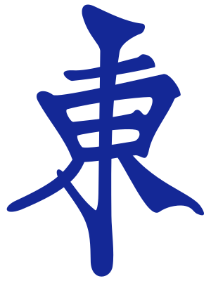
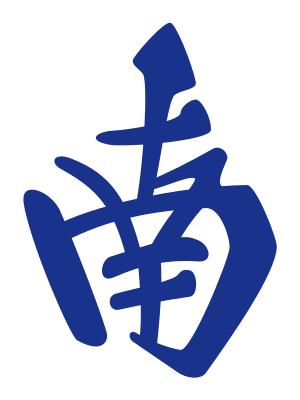
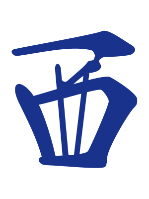
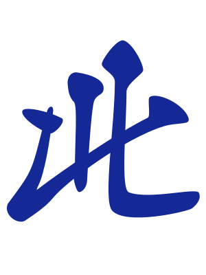
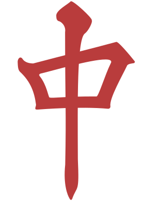
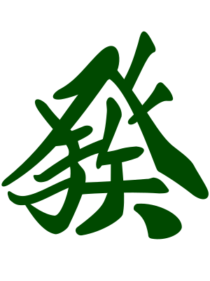
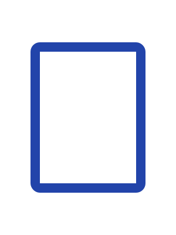

<div align="center">

# Hand Betting

**A Mahjong-themed higher/lower betting game**

*Draw tiles, bet on the next hand, and push your streak as far as it will go.*

<br/>


<br/>





&nbsp;&nbsp;




</div>

---

## About

Hand Betting is a single-page web game inspired by Mahjong tiles. Each round you're dealt a hand of four tiles, and you must predict whether the **next** hand will be higher or lower in total value. Sounds simple — but the twist is that special tiles (winds and dragons) **shift in value** after every round, making each decision progressively harder to predict.

The game tracks your score locally and maintains a leaderboard so you can compete against yourself (or anyone else on the same browser).

---

## Game Rules

### The Deck

| Category | Tiles | Count | Starting Value |
|----------|-------|-------|----------------|
| **Number** (Man) | Man 1 through Man 9 | 9 types x 4 copies = 36 | Face value (1–9, fixed) |
| **Wind** | East, South, West, North | 4 types x 4 copies = 16 | 5 (mutable) |
| **Dragon** | Red, Green, White | 3 types x 4 copies = 12 | 5 (mutable) |
| | | **64 tiles total** | |

### How to Play

1. **Start** — The deck is shuffled and you're dealt a hand of **4 tiles**. The hand's value is the sum of its tile values.

2. **Bet** — Look at your current hand and predict: will the next hand be **higher** or **lower**?

3. **Reveal** — Four new tiles are drawn and revealed one by one. The new hand's total is compared to the old:
   - **Correct bet** → +1 point
   - **Wrong bet** → −1 point (minimum score is 0)
   - **Tie** → no change

4. **Tile Value Shift** — After each non-tie round, every **special tile** (wind or dragon) that appeared in the *previous* hand has its value shifted:
   - If your bet was correct: each special tile's value increases by 1
   - If your bet was wrong: each special tile's value decreases by 1
   - This mutation is **global** — it affects those tile types for the rest of the game

5. **Repeat** — The new hand becomes your current hand and the cycle continues.

### Game Over

The game ends when either condition is met:

- **Tile Limit** — A special tile's value would be pushed below 1 or above 9. The round that triggers this is the final round.
- **Max Reshuffles** — When the draw pile runs out, the discard pile is reshuffled back in. After **3 reshuffles**, the game is over.

Your final score is saved to the local leaderboard.

---

## Tile Reference

<div align="center">

### Number Tiles (Man)

Values are fixed at face value.

|  |  
|:---:|:---:|
| **1** | **2** |
### Wind Tiles

Starting value: **5** (shifts during play).

|  |  |  |  |
|:---:|:---:|:---:|:---:|
| **East** | **South** | **West** | **North** |

### Dragon Tiles

Starting value: **5** (shifts during play).

|  |  |  |
|:---:|:---:|:---:|
| **Red** | **Green** | **White** |

</div>

---

## Tech Stack

| Layer | Technology |
|-------|-----------|
| **Framework** |  React 19 |
| **Language** |  TypeScript 6 |
| **Build Tool** |  Vite 8 |
| **Styling** |  Tailwind CSS v4 |
| **State Management** |  Zustand |
| **Animation** |  Motion (Framer Motion) |
| **Routing** |  React Router v7 |
| **Compiler** |  React Compiler (`babel-plugin-react-compiler`) |

---

## Project Structure

```
src/
├── assets/
│   └── tiles/            # Mahjong tile SVGs (Man 1-9, Winds, Dragons, Back)
├── components/
│   └── Button.tsx        # Shared button component
├── constants/
│   └── tiles.ts          # Tile definitions, deck creation, shuffle logic
├── fonts/                # Inter, Noto Serif, Space Mono
├── hooks/
│   └── userLocalStorage.ts   # LocalStorage helpers (scores, hand history)
├── layouts/
│   └── MainLayout.tsx    # App shell / layout wrapper
├── pages/
│   ├── landing/          # Landing page + Leaderboard
│   ├── signin/           # Username entry
│   └── game/             # Core game UI
│       ├── Game.tsx              # Main game orchestrator & phase state machine
│       ├── TopBar.tsx            # Score display, round info
│       ├── HandDisplay.tsx       # Renders a hand of tiles
│       ├── BettingControls.tsx   # Higher / Lower buttons
│       ├── TileCard.tsx          # Individual tile renderer
│       ├── TileValueTracker.tsx  # Live special-tile value sidebar
│       ├── HistoryStrip.tsx      # Round history feed
│       ├── DeckShuffleDeal.tsx   # Shuffle & deal animations
│       └── GameOverScreen.tsx    # End-of-game overlay
├── store/
│   ├── useGameStore.ts          # Global app state (user session)
│   └── useGameSessionStore.ts   # Core game logic (betting, scoring, tile mutation)
├── types/
│   ├── tile.ts           # Tile union types (NumberTile, WindTile, DragonTile)
│   └── game.ts           # Game session types (GameSession, BetDirection, etc.)
├── App.tsx               # Route definitions
├── main.tsx              # Entry point
└── index.css             # Global styles & Tailwind directives
```

---

## Getting Started

### Prerequisites

- **Node.js** >= 18
- **npm** >= 9

### Setup

```bash
# Clone the repository
git clone <repo-url> handbetting-2
cd handbetting-2

# Install dependencies
npm install

# Start the dev server
npm run dev
```

The app will be available at `http://localhost:5173`.

### Build for Production

```bash
npm run build
npm run preview   # preview the production build locally
```

---

## Human vs. AI Contributions

This project was built as a collaboration between a human developer and AI tooling. Here's an honest breakdown of who did what.

### Handwritten by the Developer

The **design, architecture, and decision-making** were entirely human-driven:

- **Project structure & scaffolding** — Directory layout, file organization, and module boundaries
- **Tech stack selection** — Choosing React 19, Vite 8, TypeScript, Zustand, Tailwind CSS v4, Motion, and React Router v7
- **Overall architecture** — Page structure (landing, sign-in, game), layout system, and routing design
- **Game design & rules** — The entire higher/lower betting concept, tile value mutation mechanic, reshuffle limits, and game-over conditions
- **State management design** — Zustand store architecture with `useGameSessionStore` (game logic) and `useGameStore` (app-level state), including the action API surface (`startGame`, `placeBet`, `resolveBet`, `reshuffle`, `applyTileUpdate`, etc.)
- **Game logic** — Bet resolution algorithm, score delta calculation, tie handling, special tile value shifting, tile-limit and max-reshuffle game-over detection, draw pile / discard pile cycling
- **Type system** — Discriminated union types for tiles (`NumberTile | WindTile | DragonTile`), game session types (`GameSession`, `BetDirection`, `GameOverReason`), and score entry types
- **Constants & configuration** — Tile definitions, copies-per-tile, hand size, max reshuffles, minimum score, deck creation and shuffle functions
- **Component decomposition** — Breaking the game UI into `Game` (phase state machine), `TopBar`, `HandDisplay`, `BettingControls`, `TileCard`, `TileValueTracker`, `HistoryStrip`, `DeckShuffleDeal`, and `GameOverScreen`
- **Phase state machine** — The `idle → starting → betting → revealing → revealed → gameOver` flow with reshuffle branching, managed entirely in the `Game` component
- **Local storage persistence** — Score saving, hand history tracking, and leaderboard retrieval
- **Leaderboard design** — Top-N score display on the landing page

### AI-Assisted (Supervised by the Developer)

The **implementation labor** was largely AI-generated under human direction and review:

- **Coding implementation** — Translating the planned architecture, types, and game logic into working TypeScript/React code
- **CSS & styling** — Tailwind utility class composition, color palette, spacing, and typography choices
- **Animations & transitions** — Motion integration for tile reveals (sequential flip with configurable step timing), shuffle/deal card animations, score and tile-delta pulse effects
- **Component markup & JSX** — Structural HTML/JSX within each component
- **Responsive layout** — Grid breakpoints, mobile-friendly adjustments, and sizing fine-tuning
- **This README** — The document you're reading right now was generated by AI based on the developer's specifications and project context

---

## License

Mahjong tile SVGs are sourced under their own license — see [`src/assets/tiles/LICENSE`](src/assets/tiles/LICENSE) for details.
