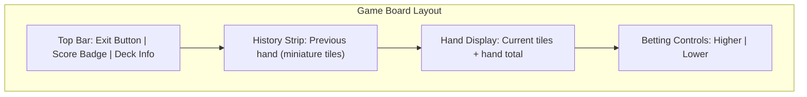
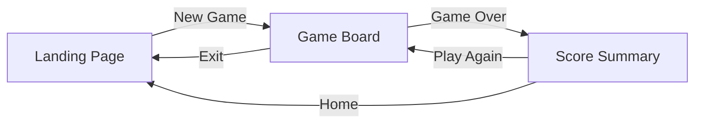
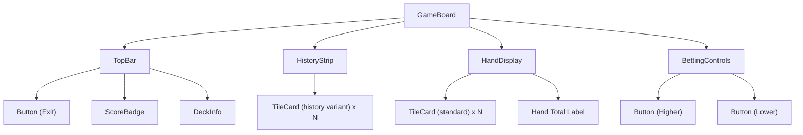

# Design Specification — Hand Betting Game

This document defines every visual and interaction design decision for the Mahjong Hand Betting Game. It serves as the single source of truth for colors, typography, component specs, layout, responsiveness, animations, and accessibility.

---

## 1. Design Philosophy

The game targets a **premium dark-themed casino** aesthetic with subtle eastern-inspired accents. Every design choice follows three principles:

1. **Tiles are the hero** — the Mahjong tiles and the score are always the most visually prominent elements on screen. UI chrome (navigation, labels, controls) stays quiet and recedes.
2. **Confidence through feedback** — every player action produces immediate, satisfying visual and motion feedback. Betting, revealing, winning, losing — each moment has a distinct feel.
3. **Minimal but rich** — the interface is uncluttered with generous whitespace, but the surfaces that do exist carry depth through subtle gradients, glows, and shadows.

---

## 2. Color System

All colors are defined as CSS custom properties (Tailwind CSS v4 design tokens) so every component references tokens, never raw hex values.

### 2.1 Core Palette

| Token                  | Value       | Usage                                      |
| ---------------------- | ----------- | ------------------------------------------ |
| `--color-bg-primary`   | `#0B0F19`   | Page background, deepest layer             |
| `--color-bg-secondary` | `#131928`   | Card surfaces, panels, modal backdrops     |
| `--color-bg-elevated`  | `#1C2333`   | Elevated cards, tile backs, hover surfaces |
| `--color-border`       | `#2A3348`   | Subtle dividers, card outlines             |
| `--color-border-focus` | `#4A7CFF`   | Focus rings, active input borders          |
| `--color-text-primary` | `#F1F3F8`   | Headings, primary content                  |
| `--color-text-secondary`| `#8B95AD`  | Labels, descriptions, metadata             |
| `--color-text-muted`   | `#505A72`   | Disabled text, placeholders                |

### 2.2 Semantic / Feedback Colors

| Token                  | Value       | Usage                                 |
| ---------------------- | ----------- | ------------------------------------- |
| `--color-win`          | `#34D399`   | Win state: backgrounds, borders, text |
| `--color-win-glow`     | `#34D39940` | Win glow overlay (25% opacity)        |
| `--color-loss`         | `#F87171`   | Loss state: backgrounds, borders, text|
| `--color-loss-glow`    | `#F8717140` | Loss glow overlay (25% opacity)       |
| `--color-accent`       | `#FBBF24`   | Gold accent: score highlights, CTA    |
| `--color-accent-hover` | `#F59E0B`   | Gold accent hover state               |
| `--color-neutral`      | `#6B7280`   | Tie/push state, inactive elements     |

### 2.3 Tile Category Colors

| Tile Category | Primary Color | Background Tint | Border Color |
| ------------- | ------------- | ---------------- | ------------ |
| Number        | `#F1F3F8`     | `#1C2333`        | `#2A3348`    |
| Dragon Red    | `#EF4444`     | `#3B1111`        | `#7F1D1D`    |
| Dragon Green  | `#22C55E`     | `#0D3320`        | `#166534`    |
| Dragon White  | `#E2E8F0`     | `#1E293B`        | `#475569`    |
| Wind          | `#60A5FA`     | `#0C1E3A`        | `#1E40AF`    |

### 2.4 Gradient Accents

- **Table felt**: radial gradient from `#131928` center to `#0B0F19` edges — applied to the game board background to simulate depth.
- **Gold shimmer**: linear gradient `135deg` from `#FBBF24` to `#F59E0B` — used on the primary CTA button and score badge.
- **Tile back pattern**: repeating diagonal hatches using `--color-bg-elevated` and `--color-border` to distinguish unrevealed tiles.

---

## 3. Typography

### 3.1 Font Stack

| Role     | Font                           | Fallback                     |
| -------- | ------------------------------ | ---------------------------- |
| Display  | **Noto Serif** (Google Fonts)  | Georgia, serif               |
| Body/UI  | **Inter** (Google Fonts)       | system-ui, sans-serif        |
| Monospace| **JetBrains Mono**             | ui-monospace, monospace      |

Noto Serif provides an eastern-calligraphy feel for headings and the game title. Inter handles all UI text with excellent legibility at small sizes. JetBrains Mono is used exclusively for numeric values (scores, tile values) to ensure tabular alignment.

### 3.2 Type Scale

| Token       | Size    | Weight | Line Height | Usage                        |
| ----------- | ------- | ------ | ----------- | ---------------------------- |
| `display`   | 48px    | 700    | 1.1         | Landing page title           |
| `h1`        | 32px    | 700    | 1.2         | Screen headings              |
| `h2`        | 24px    | 600    | 1.3         | Section titles, score total  |
| `h3`        | 18px    | 600    | 1.4         | Card headings, labels        |
| `body`      | 16px    | 400    | 1.5         | Default text                 |
| `body-sm`   | 14px    | 400    | 1.5         | Secondary text, metadata     |
| `caption`   | 12px    | 500    | 1.4         | Badges, counters, footnotes  |
| `score`     | 56px    | 700    | 1.0         | Final score display (mono)   |
| `tile-value`| 28px    | 700    | 1.0         | Value on a tile face (mono)  |
| `tile-sm`   | 18px    | 700    | 1.0         | Value on a history tile (mono)|

---

## 4. Layout Architecture

### 4.1 Landing Page

```
+--------------------------------------------------+
|                    HEADER                         |
|              Game Title (display)                 |
|           Subtitle / tagline (body)              |
+--------------------------------------------------+
|                                                  |
|          [ ====  NEW GAME  ==== ]                |
|            Gold CTA button, centered             |
|                                                  |
+--------------------------------------------------+
|              LEADERBOARD PANEL                   |
|  +--------------------------------------------+ |
|  | Rank | Name       | Score      | Date      | |
|  |  1   | ---------- | ---------- | --------- | |
|  |  2   | ---------- | ---------- | --------- | |
|  |  3   | ---------- | ---------- | --------- | |
|  |  4   | ---------- | ---------- | --------- | |
|  |  5   | ---------- | ---------- | --------- | |
|  +--------------------------------------------+ |
+--------------------------------------------------+
```

- The page is vertically centered within the viewport using flexbox.
- Maximum content width: `480px`.
- The leaderboard is a `--color-bg-secondary` card with `--color-border` outline, rounded corners (`border-radius: 12px`), and `16px` internal padding.
- Empty leaderboard slots show a dashed placeholder row.

### 4.2 Game Board



**Top Bar** (sticky, top of viewport)
- Left: Exit button (icon + "Exit" label).
- Center: Score badge with current score, animated on change.
- Right: Deck info — Draw Pile count and Discard Pile count displayed as two pill-shaped badges.

**History Strip**
- Horizontally scrollable row of miniature tiles from the previous hand.
- Each tile is 60% the size of a main tile.
- Includes a small label showing the previous hand's total value.
- Faded opacity (`0.7`) to visually recede behind the current hand.

**Hand Display** (center of screen, primary focus)
- Tiles arranged in a horizontal row, centered.
- Below the tiles: the hand total displayed in `h2` size with the `score` monospace font.
- Win/loss flash overlay appears behind the tiles on result reveal.

**Betting Controls** (bottom, fixed on mobile)
- Two large buttons side by side:
  - **Bet Higher** — upward arrow icon, uses `--color-win` tint on hover.
  - **Bet Lower** — downward arrow icon, uses `--color-loss` tint on hover.
- Disabled and visually muted during the revealing phase.

### 4.3 Score Summary (Game Over)

```
+--------------------------------------------------+
|              GAME OVER                           |
|                                                  |
|           Final Score: 1,250                     |
|          (count-up animation)                    |
|                                                  |
|   +------------------------------------------+   |
|   | Hands Won:  12  |  Hands Lost:  8        |   |
|   | Reshuffles: 2   |  Rounds:     20        |   |
|   +------------------------------------------+   |
|                                                  |
|   Game Over Reason: Tile reached boundary        |
|                                                  |
|   [ PLAY AGAIN ]      [ HOME ]                   |
+--------------------------------------------------+
```

- Centered card layout, maximum width `520px`.
- The final score uses the `score` type token (56px, monospace, bold) with the gold accent color.
- Stats grid below the score uses two columns.
- Two action buttons at the bottom: "Play Again" (primary gold) and "Home" (secondary outline).

---

## 5. Component Design Specifications

### 5.1 TileCard

The tile is the core visual element of the game.

**Dimensions**

| Variant  | Width | Height | Border Radius |
| -------- | ----- | ------ | ------------- |
| Standard | 72px  | 100px  | 8px           |
| History  | 48px  | 66px   | 6px           |

**Structure (front face)**
- Background: white (`#F8FAFC`) with a `1px` inset border matching the tile category color.
- Top-left corner: small category icon or character (dragon glyph, wind kanji, or number).
- Center: large tile value in `tile-value` size.
- Bottom-right corner: mirrored small icon (rotated 180deg), classic card-style.
- For Dragon and Wind tiles: a subtle colored gradient wash behind the center area using the tile category background tint.

**Structure (back face)**
- Background: `--color-bg-elevated`.
- Repeating diagonal crosshatch pattern using `--color-border` at 45deg.
- Centered Mahjong-style icon or decorative seal in `--color-text-muted`.

**States**

| State      | Visual Treatment                                               |
| ---------- | -------------------------------------------------------------- |
| Unrevealed | Shows back face. Slight vertical hover lift (`translateY(-2px)`). |
| Revealing  | 3D flip animation (see Section 8). Back rotates to front.     |
| Revealed   | Shows front face. Slight outer glow matching category color.  |
| Win        | Green glow pulse (`box-shadow` animation) for 600ms after result. |
| Loss       | Red glow pulse for 600ms after result.                        |
| History    | Smaller variant, reduced opacity (0.7), no hover effects.     |

### 5.2 Button

Three variants with shared structure:

**Shared properties**: `border-radius: 8px`, `font-weight: 600`, `font-size: 16px`, `padding: 12px 24px`, `transition: all 150ms ease`.

| Variant   | Background                     | Text Color    | Border                   |
| --------- | ------------------------------ | ------------- | ------------------------ |
| Primary   | Gold gradient                  | `#0B0F19`     | None                     |
| Secondary | Transparent                    | `--color-text-primary` | `1px solid --color-border` |
| Danger    | Transparent                    | `--color-loss` | `1px solid --color-loss` |

**Sizes**

| Size  | Padding      | Font Size | Min Width |
| ----- | ------------ | --------- | --------- |
| `sm`  | `8px 16px`   | 14px      | 80px      |
| `md`  | `12px 24px`  | 16px      | 120px     |
| `lg`  | `16px 32px`  | 18px      | 160px     |

**Interactive states**:
- **Hover**: brightness increase (`filter: brightness(1.1)`), subtle `translateY(-1px)`.
- **Active/Pressed**: `translateY(0px)`, brightness decrease (`filter: brightness(0.95)`), `scale(0.98)`.
- **Disabled**: `opacity: 0.4`, `cursor: not-allowed`, no hover effects.
- **Focus-visible**: `2px` offset ring using `--color-border-focus`.

### 5.3 ScoreBadge

- Pill-shaped container: `border-radius: 9999px`, `padding: 6px 20px`.
- Background: `--color-bg-elevated` with `1px` border of `--color-border`.
- Interior: label "Score" in `caption` size + the numeric value in `h3` monospace.
- On value change: the number scales up to `1.15x` and back over 300ms (spring easing). Color temporarily flashes `--color-win` on increase or `--color-loss` on decrease.

### 5.4 DeckInfo

Two pill badges displayed horizontally:
- **Draw Pile**: card-stack icon + count. Uses `--color-accent` text when count is low (< 10 tiles).
- **Discard Pile**: layered-cards icon + count. Uses `--color-text-secondary`.
- On reshuffle: both badges shake briefly (horizontal oscillation, 300ms) to indicate deck reconstitution.

### 5.5 Leaderboard

- Table inside a `--color-bg-secondary` card.
- Column headers: `caption` size, `--color-text-muted`, uppercase, letter-spacing `0.05em`.
- Rows: `body` size. Alternating row backgrounds (odd rows get a `4%` white overlay).
- Rank #1 row: gold left-border accent (`3px solid --color-accent`).
- If the player's current score qualifies, that row highlights with a `--color-accent` background at `10%` opacity and a subtle pulse animation.
- Empty slots: dashed border row with "---" placeholder text in `--color-text-muted`.

### 5.6 HistoryStrip

- Container: horizontal flex row with `gap: 8px`, centered.
- Previous hand label: "Previous Hand" in `caption` size above the tiles.
- Previous total: displayed to the right of the tile row in `body-sm` monospace.
- The entire strip sits in a `--color-bg-secondary` band with `8px` vertical padding and a top/bottom border of `--color-border`.
- When no history exists (first hand), the strip shows "No previous hand" in `--color-text-muted`, italicized.

---

## 6. Tile Visual Design

### 6.1 Number Tiles (1-9)

- Clean white face with minimal decoration.
- The number displayed large and centered in a bold serif font (Noto Serif).
- A small circular pip in the top-left corner with the numeral repeated at `caption` size.
- Border color: `--color-border` (neutral).

### 6.2 Dragon Tiles

Each dragon has a distinct visual identity:

| Dragon | Center Glyph         | Color Treatment                              |
| ------ | -------------------- | -------------------------------------------- |
| Red    | `\u7AEA` (character) | Red gradient wash, `#EF4444` border accent   |
| Green  | `\u767C` (character) | Green gradient wash, `#22C55E` border accent |
| White  | Empty frame / box    | Subtle silver border, `#E2E8F0` accent       |

- Each dragon tile carries a small value badge in the bottom-right corner showing its `currentValue` (starts at 5). The badge is a rounded rectangle (`border-radius: 4px`) with the tile category background.
- When the value changes, the badge pulses with either `--color-win` or `--color-loss`.

### 6.3 Wind Tiles

| Wind  | Center Glyph         | Direction Indicator |
| ----- | -------------------- | ------------------- |
| East  | `\u6771` (character) | Right-pointing chevron  |
| South | `\u5357` (character) | Down-pointing chevron   |
| West  | `\u897F` (character) | Left-pointing chevron   |
| North | `\u5317` (character) | Up-pointing chevron     |

- All wind tiles share the blue color treatment (`#60A5FA` border, `#0C1E3A` background tint).
- Same value badge system as dragon tiles.

### 6.4 Tile Value Badge (Dragon and Wind only)

- Position: bottom-right corner of the tile, offset `4px` from each edge.
- Size: `20px x 20px` (standard), `14px x 14px` (history variant).
- Background: tile category color at `20%` opacity.
- Text: `currentValue` in monospace, white, `caption` size.
- Pulsing animation on value change (scale 1.0 -> 1.3 -> 1.0 over 400ms).

---

## 7. Responsiveness

### 7.1 Breakpoint Strategy

The layout is mobile-first. All base styles target narrow viewports; wider layouts are layered on progressively.

| Breakpoint | Width    | Target Devices               |
| ---------- | -------- | ---------------------------- |
| `sm`       | >= 640px | Large phones (landscape)     |
| `md`       | >= 768px | Tablets                      |
| `lg`       | >= 1024px| Small laptops, landscape tablets |
| `xl`       | >= 1280px| Desktops                     |

### 7.2 Layout Adjustments by Breakpoint

**Landing Page**

| Breakpoint | Change                                                     |
| ---------- | ---------------------------------------------------------- |
| Base       | Full-width padding `16px`. Title at `32px`. Stacked layout.|
| `sm`       | Content max-width `420px`, centered.                       |
| `md`       | Title scales to `40px`. Leaderboard gains more spacing.    |
| `lg+`      | Title at full `48px`. Max-width `480px`.                   |

**Game Board**

| Breakpoint | Change                                                              |
| ---------- | ------------------------------------------------------------------- |
| Base       | Tiles stack in a 2-column grid. Betting controls fixed to bottom. Touch targets 48px minimum. |
| `sm`       | Tiles fit in a single row (up to 5 tiles). Controls remain bottom-fixed. |
| `md`       | History strip moves from above the hand to a side panel on the left. Top bar becomes more spacious. |
| `lg+`      | Full horizontal layout. History on left, hand center, controls right. Maximum content width `960px`. |

**Score Summary**

| Breakpoint | Change                                              |
| ---------- | --------------------------------------------------- |
| Base       | Single-column stack. Score at `40px`.               |
| `md+`      | Stats in two-column grid. Score at full `56px`.     |

### 7.3 Touch Targets

All interactive elements observe minimum touch target sizes per WCAG guidelines:

| Element          | Minimum Size | Notes                             |
| ---------------- | ------------ | --------------------------------- |
| Buttons          | 44px height  | Full width on mobile base layout  |
| Betting Controls | 56px height  | Extra large for primary game action|
| Exit Button      | 44px x 44px  | Icon button with visible label on `md+` |
| Tile (tappable)  | 72px x 100px | Standard tile size meets threshold|

---

## 8. Animation Specifications

All animations use Framer Motion. Durations and easings are defined as constants in `lib/constants.ts` to keep motion tuning centralized.

### 8.1 Tile Deal (Hand Entrance)

| Property     | Value                                              |
| ------------ | -------------------------------------------------- |
| Trigger      | New hand is drawn                                  |
| Type         | Staggered slide-in from right + fade               |
| Initial      | `{ opacity: 0, x: 80, scale: 0.8 }`               |
| Animate      | `{ opacity: 1, x: 0, scale: 1.0 }`                |
| Easing       | Spring: `stiffness: 300, damping: 24`              |
| Stagger      | `staggerChildren: 0.08` (80ms between each tile)   |

### 8.2 Tile Flip (Reveal)

| Property     | Value                                              |
| ------------ | -------------------------------------------------- |
| Trigger      | Bet is placed, tiles reveal sequentially            |
| Type         | 3D Y-axis rotation                                  |
| Phase 1      | `{ rotateY: 0 }` to `{ rotateY: 90 }` (150ms)     |
| Midpoint     | Swap face content (back -> front) at 90deg          |
| Phase 2      | `{ rotateY: 90 }` to `{ rotateY: 0 }` (150ms)     |
| Easing       | `easeInOut`                                          |
| Stagger      | 120ms between each tile                             |
| CSS          | `perspective: 800px` on the parent, `transform-style: preserve-3d` on the tile |

### 8.3 Bet Result Feedback

| Property     | Value                                              |
| ------------ | -------------------------------------------------- |
| Trigger      | All tiles revealed, result computed                  |
| Win Flash    | Hand area background flashes `--color-win-glow` (fade-in 100ms, hold 300ms, fade-out 200ms) |
| Loss Flash   | Hand area background flashes `--color-loss-glow` (same timing) |
| Score Pulse  | Score badge scales `1.0 -> 1.15 -> 1.0` over 300ms, color shifts to win/loss |

### 8.4 Hand to History Transition

| Property     | Value                                              |
| ------------ | -------------------------------------------------- |
| Trigger      | Current hand moves to history, new hand incoming    |
| Exit         | `{ opacity: 0, x: -100, scale: 0.6 }` over 400ms  |
| Easing       | `easeIn`                                            |
| Technique    | `AnimatePresence` with `mode="wait"` to sequence exit before new hand enters |

### 8.5 Score Count-Up (Game Over)

| Property     | Value                                              |
| ------------ | -------------------------------------------------- |
| Trigger      | Score summary screen mounts                         |
| Type         | Numeric count from 0 to final score                  |
| Duration     | `1200ms`                                             |
| Easing       | `easeOut` (fast start, slow finish)                  |
| Implementation | `useMotionValue` + `useTransform` from Framer Motion, or a `requestAnimationFrame` loop interpolating the displayed number |

### 8.6 Page Transitions

| Property     | Value                                              |
| ------------ | -------------------------------------------------- |
| Trigger      | Route change (landing -> game, game -> summary)     |
| Enter        | `{ opacity: 0, y: 20 }` to `{ opacity: 1, y: 0 }` over 300ms |
| Exit         | `{ opacity: 1, y: 0 }` to `{ opacity: 0, y: -20 }` over 200ms |
| Easing       | `easeInOut`                                          |
| Technique    | `AnimatePresence` wrapping the route outlet          |

### 8.7 Deck Reshuffle

| Property     | Value                                              |
| ------------ | -------------------------------------------------- |
| Trigger      | Draw pile exhausted, reshuffle occurs                |
| Type         | Deck info badges shake horizontally                  |
| Keyframes    | `x: [0, -4, 4, -4, 4, 0]` over 400ms               |
| Accompaniment| Brief screen overlay: "Reshuffling..." text fades in and out over 800ms |

---

## 9. Microinteractions and Feedback

### 9.1 Button Press

- On `pointerdown`: scale to `0.97`, background darkens slightly.
- On `pointerup`: spring back to `1.0`. Total press animation: 120ms.
- Betting buttons additionally emit a subtle radial ripple from the press point (CSS `::after` pseudo-element expanding outward).

### 9.2 Hover States

- **Tiles**: lift `translateY(-2px)` with increased `box-shadow` depth. Transition: 150ms ease.
- **Buttons**: brightness boost + slight lift (see Section 5.2).
- **Leaderboard rows**: background lightens by `4%`. Transition: 100ms ease.
- **Exit button**: icon rotates -90deg (pointing toward door/exit). Transition: 200ms ease.

### 9.3 Score Change

- On score increase: the ScoreBadge number flashes `--color-win` and a small `+N` floats upward and fades out over 600ms (floating text animation).
- On score decrease: the ScoreBadge number flashes `--color-loss` and a small `-N` floats downward and fades out over 600ms.

### 9.4 Tile Value Change (Dragon/Wind)

- When a non-number tile's `currentValue` changes:
  - The value badge scales up (`1.3x`) and back over 400ms.
  - Badge background briefly flashes the win/loss color.
  - A small directional arrow (up for +1, down for -1) appears next to the badge and fades out over 500ms.

### 9.5 Game Over Trigger

- The screen dims slightly (dark overlay at `40%` opacity, fading in over 300ms).
- The game-over card slides up from the bottom with a spring animation (`stiffness: 200, damping: 20`).
- If triggered by a tile reaching boundary (0 or 10): the offending tile briefly flashes and shakes before the overlay appears.
- If triggered by 3rd deck exhaustion: the deck info badges flash three times before the overlay appears.

### 9.6 First Hand (No Bet)

- On the very first hand (no previous hand to compare against), betting controls are disabled.
- A pulsing text hint appears below the hand: "Your first hand — next round you'll bet!" in `--color-text-secondary`, with a gentle opacity pulse (`0.5 -> 1.0 -> 0.5`, 2s loop).

---

## 10. Accessibility

### 10.1 Color Contrast

All text meets WCAG 2.1 AA contrast ratios:

| Combination                              | Ratio   | Requirement |
| ---------------------------------------- | ------- | ----------- |
| `--color-text-primary` on `--color-bg-primary`    | 15.2:1  | AAA         |
| `--color-text-secondary` on `--color-bg-primary`  | 5.8:1   | AA          |
| `--color-text-primary` on `--color-bg-secondary`  | 12.1:1  | AAA         |
| `--color-win` on `--color-bg-primary`              | 8.4:1   | AAA         |
| `--color-loss` on `--color-bg-primary`             | 5.1:1   | AA          |
| Gold button text (`#0B0F19`) on gold bg            | 10.8:1  | AAA         |

Win/loss states are never communicated by color alone — they are always paired with directional icons (up arrow / down arrow) and text labels ("Win" / "Loss").

### 10.2 Focus Management

- All interactive elements have a visible focus ring: `2px solid --color-border-focus` with a `2px` offset.
- Focus rings only appear on keyboard navigation (`:focus-visible`), not on mouse clicks.
- When the game phase changes (bet placed, result revealed, game over), focus is programmatically moved to the most relevant element:
  - After bet: focus moves to the first tile being revealed.
  - After result: focus moves to the score badge.
  - After game over: focus moves to the "Play Again" button.

### 10.3 Keyboard Navigation

| Key            | Action                                     |
| -------------- | ------------------------------------------ |
| `Tab`          | Move focus through interactive elements    |
| `Enter`/`Space`| Activate the focused button                |
| `H`            | Shortcut: Bet Higher (when controls active)|
| `L`            | Shortcut: Bet Lower (when controls active) |
| `Escape`       | Open exit confirmation / return to landing |

### 10.4 Screen Reader Support

- Tiles are announced as: "[Category] tile, value [N]" (e.g., "Red Dragon tile, value 5").
- Hand total is a live region (`aria-live="polite"`) that announces when the total updates.
- Score badge is a live region (`aria-live="polite"`) that announces score changes.
- Bet result is announced: "You [won/lost]. Hand total was [N], previous was [M]."
- Game-over reason is announced with `aria-live="assertive"`.
- Animations respect `prefers-reduced-motion`:
  - All Framer Motion durations drop to 0.
  - Tile flip becomes an instant swap (no 3D rotation).
  - Score count-up shows the final number immediately.
  - Page transitions become instant cuts.

### 10.5 Reduced Motion

When `prefers-reduced-motion: reduce` is active:

- All spring/tween animations are replaced with instant state changes.
- Stagger delays are removed.
- Glow and pulse effects are replaced with static color changes.
- The tile flip becomes a simple crossfade (opacity 1 -> 0 on back, 0 -> 1 on front, 200ms).

---

## 11. Visual Summary

### Screen Flow



### Game Board Component Hierarchy


